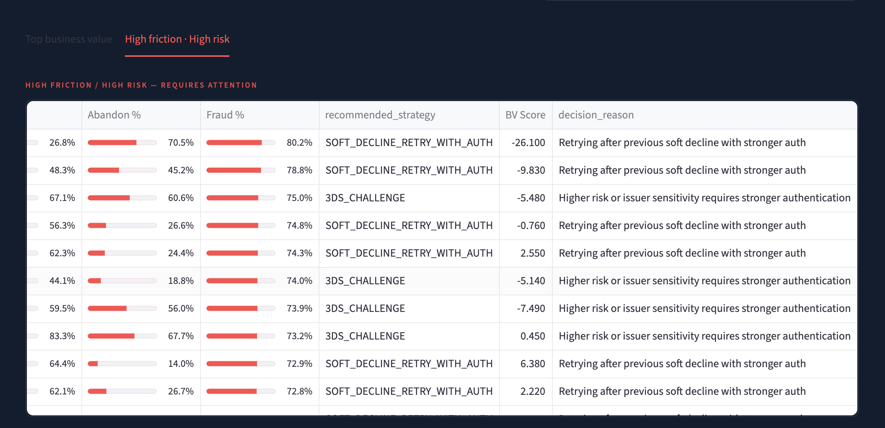
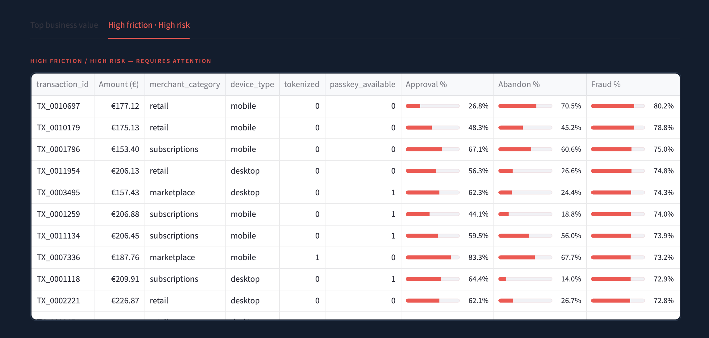
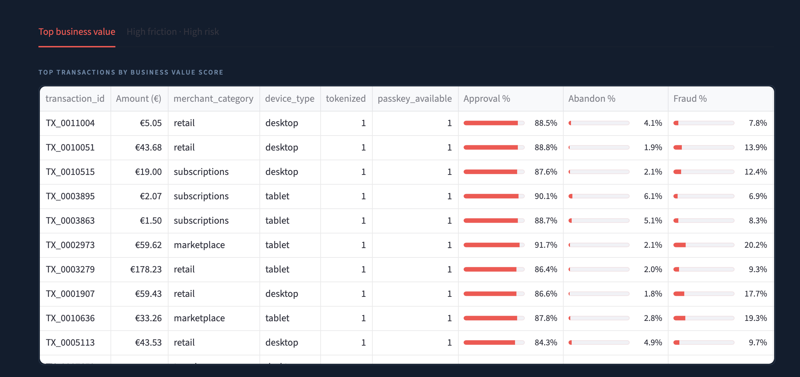
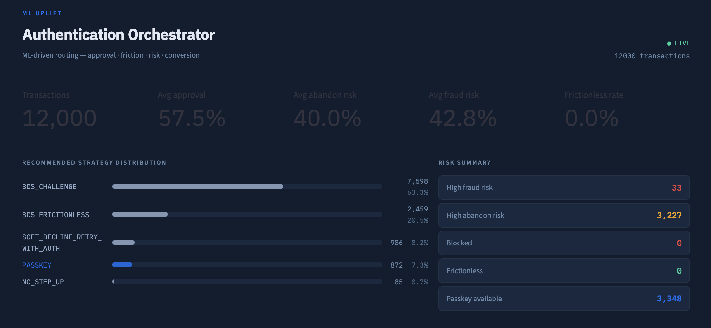
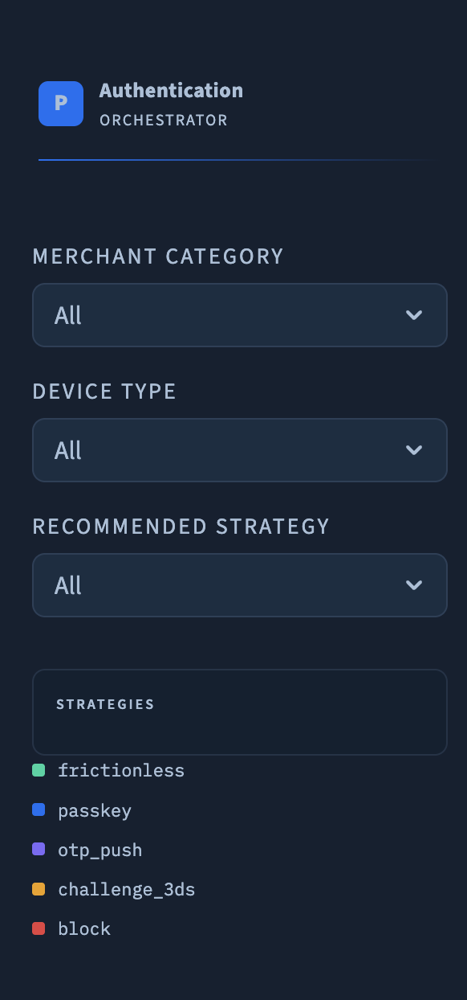

# 🔐 Payment Authentication Orchestrator (AI)

## 🚀 Overview

This project showcases an **AI-powered authentication decision engine** designed to optimize payment flows.

Instead of applying static rules (e.g. always 3DS), the system dynamically decides:

- when to apply **frictionless authentication**
- when to trigger **3DS challenge**
- when to retry after soft decline
- when to block or step-up authentication

👉 The objective:  
**maximize approval rate while minimizing friction and fraud risk**

---

## 🎯 Product Vision

Most payment systems are rule-based.

👉 This system is **decision-driven**:

- Should we authenticate this transaction?
- Which authentication method maximizes conversion?
- How do we balance **approval vs friction vs fraud risk**?

This project demonstrates a shift toward:

❌ Static payment flows  
➡️  
✅ Intelligent authentication orchestration

---

## 🧠 Core Capabilities

### 1. Multi-Objective Prediction Models

The system predicts:

- ✅ Approval probability
- ⚠️ Abandonment risk
- 🚨 Fraud risk

Using:
- Behavioral signals
- Device & merchant context
- Transaction attributes

---

### 2. Strategy Decision Engine

Each transaction is routed to an optimal strategy:

- `NO_STEP_UP`
- `3DS_FRICTIONLESS`
- `3DS_CHALLENGE`
- `PASSKEY`
- `SOFT_DECLINE_RETRY_WITH_AUTH`

👉 Based on a **business value scoring system** combining:
- approval uplift
- friction cost
- fraud exposure

---

### 3. Business Value Optimization

A scoring function determines the best strategy:

Business Value = Approval Gain - Friction Cost - Fraud Risk

👉 This transforms ML predictions into **actionable product decisions**

---

## 🖥️ Product Interface

### 🎯 Authentication Decision Engine (Hero View)



👉 Key elements:
- recommended authentication strategy
- real-time KPIs (approval / abandon / fraud)
- business value scoring
- decision reasoning

---

### ⚠️ High Friction / High Risk Transactions



👉 Highlights transactions requiring:
- stronger authentication
- retries after soft decline
- risk mitigation

---

### 📈 Top Business Value Transactions



👉 Shows where the system:
- maximizes approval
- minimizes friction
- leverages passkey / tokenization

---

### 📊 Strategy Distribution & Risk Summary



👉 Provides:
- strategy mix distribution
- fraud / abandon insights
- operational monitoring

---

### 🎛️ Segmentation & Filters



👉 Enables:
- merchant segmentation
- device-based strategy tuning
- issuer behavior analysis

---

## ⚙️ Tech Stack

- Python
- Pandas / NumPy
- Scikit-learn
- Streamlit

---

## 📊 Key Insights

- Friction (3DS challenge) is often **overused**
- Passkey / tokenization can significantly improve conversion
- Some transactions require **adaptive retry strategies**
- Optimal decisions depend on **context, not rules**

---

## 🏦 Use Cases

- Payment orchestration platforms
- PSP / fintech environments
- Checkout optimization teams
- Fraud & risk management systems

---

## 💡 Product Thinking Demonstrated

This project highlights:

- Decision-first product design
- AI applied to **business trade-offs**
- Clear link between **ML → UX → revenue impact**
- Ability to model complex systems (payments, risk, conversion)

---

## 🚀 How to run

```bash
python main.py
streamlit run app/streamlit_app.py